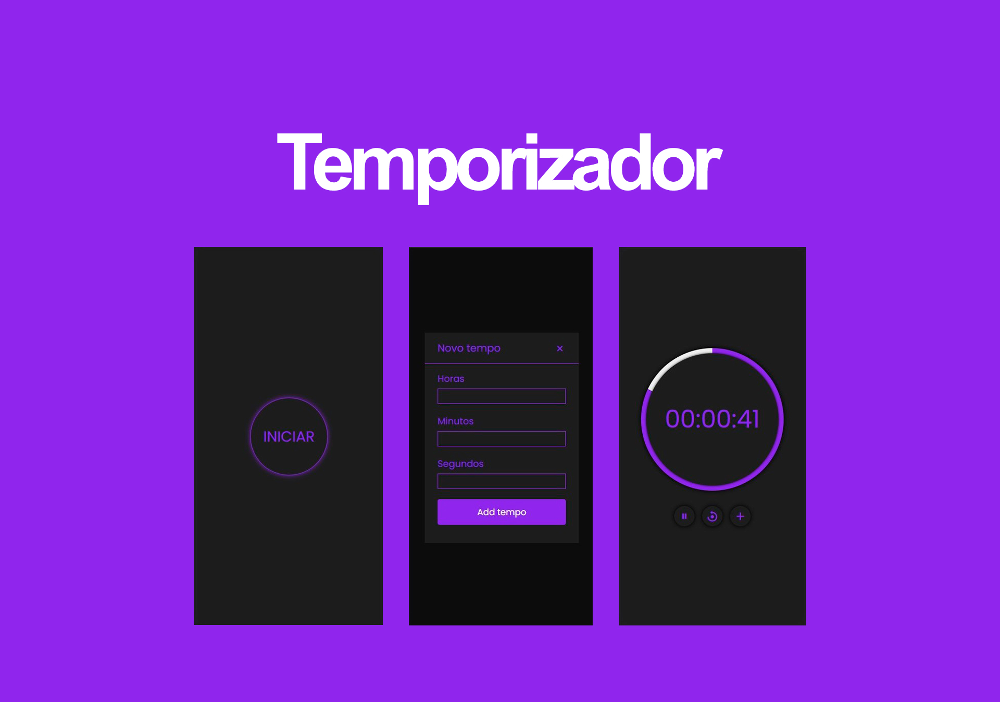

<h1 align="center">Temporizador</h1>

Projeto criado e desenvolvido por Fabricio Liquesley.  

  <a href="#-tecnologias">Tecnologias</a>&nbsp;&nbsp;&nbsp;|&nbsp;&nbsp;
  <a href="#-projeto">Projeto</a>

 

  

## 🚀 Tecnologias

Esse projeto foi desenvolvido com as seguintes tecnologias:

- HTML e CSS
- JavaScript
- Git e Github

## 💻 Projeto

O temporizador é um app que permite o usuário fazer contagens regressivas, de acordo com o tempo que ele desejar. 

- [Acesse o projeto finalizado, online](https://fabricioliquesley.github.io/temporizador/)